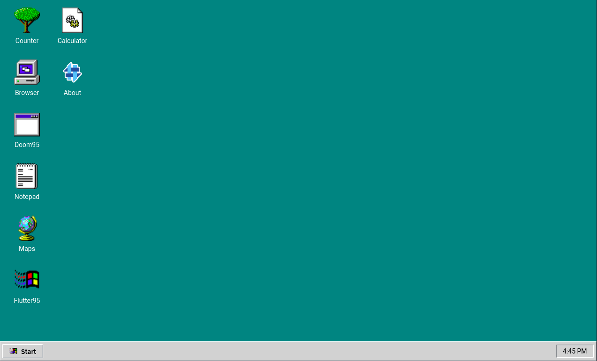
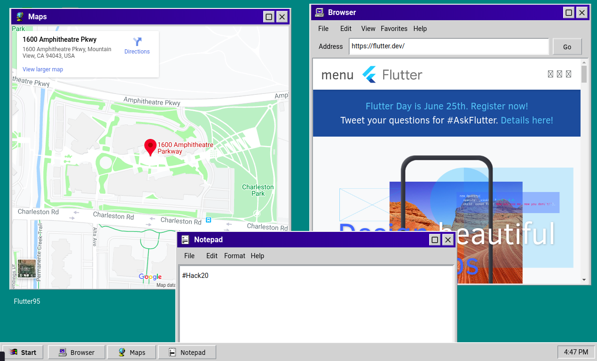
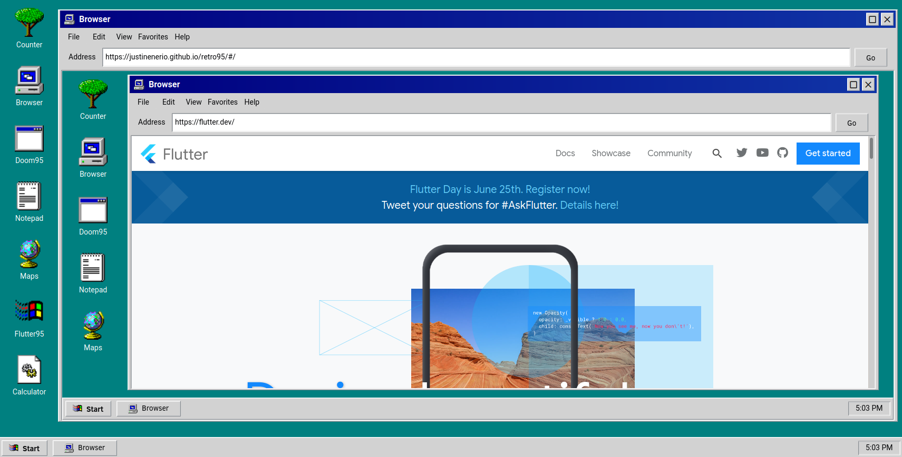

# Retro 95 - Windows 95 Desktop Experience

 

Experience nostalgia with the iconic Windows 95 right from your browser. Retro 95 is an attempt to recreate the Windows 95 desktop experience with Flutter. Contains programs like notepad , a web browser, calculator and more.

Developed with Flutter Web, but will compile to all platforms that Flutter supports.

A Retro Theme Flutter Hack 20 Entry!

## Features
* Reorder Desktop Icons
* Draggable and resizable windows
* Start Menu
* Desktop Applications
* Windows 95 Desktop Feel

## Apps
* Notepad
* Browser
* Maps
* Doom95 (Yes!)
* Flutter Counter
* Flutter95 Example App
* Calculator
* About

## Screenshots

  
  
  

## Demo

Windows 95 desktop experience right from your browser: [https://justinenerio.github.io/retro95/#/](https://justinenerio.github.io/retro95/#/)

## Getting Started

These instructions will get you a copy of the project up and running on your local machine for development and testing purposes. 

### Prerequisites

Download either Android Studio or Visual Studio Code, with their respective [Flutter editor plugins](https://flutter.dev/get-started/editor/). For more information about Flutter installation procedure, check the [official install guide](https://flutter.dev/get-started/install/).

### Steps
1. Clone the repository with the 'clone' command, or just download the zip.

2. Install dependencies from pubspec.yaml by running `flutter packages get` from the project root (see [using packages documentation](https://flutter.io/using-packages/#adding-a-package-dependency-to-an-app) for details and how to do this in the editor). 

3. Add `/constants/api_key.dart` file with API key from [Google Embedded Maps API](https://developers.google.com/maps/documentation/embed/get-api-key).

4. Run.

## Built With

* [Flutter](https://flutter.dev/) - <3
* [Flutter95](https://pub.dev/packages/flutter95) - Windows95 Theme inspiration

## Contributing

Contributions are welcome! Submit an issue for discussion and a PR for the code.

> **Note:** Code is dirty and rushed. This was made in short duration of the hackathon.

## License

This project is licensed under the MIT License - see the [LICENSE.md](./LICENSE.md) file for details

## Acknowledgments

* Flutter Community for hosting this hackathon
* [Artage.io](https://artage.io) for Windows 95 icons
